<table>
  <tr>
    <td valign="top">
      
    </td>
    <td valign="top">
      
    </td>
  </tr>
</table>

---

# Hi 👋, I'm Aditya Runwal

<h3 align="center">Aspiring AI/ML Engineer | Exploring Machine Learning, Deep Learning &amp; Generative AI</h3>

  

---

## 👨‍💻 About Me

* 🎓 Currently pursuing my **3rd year** in Engineering.
* 🤖 Aspiring to become an **AI/ML Engineer**.
* 📊 Currently working on **EDA and Machine Learning projects**.
* 🧠 Interested in **Machine Learning, Deep Learning, Generative AI, and Large Language Models (LLMs)**.
* 🎯 Focused on learning, building, and growing as an **AI/ML Engineer**.

---

## 🛠️ Languages and Tools

### 💻 Programming Languages

  

### 🤖 AI / Machine Learning &amp; Data Science

  

  
  
  
  
  

### 🗄️ Databases &amp; Tools

  

---

## 📊 GitHub Statistics

  
  

  

---

## 🌐 Connect With Me

  
  
  

---

  <i>"Learning, building, and growing — one project at a time."</i>

  ⭐ <b>Always curious. Always learning. Always building.</b> ⭐

